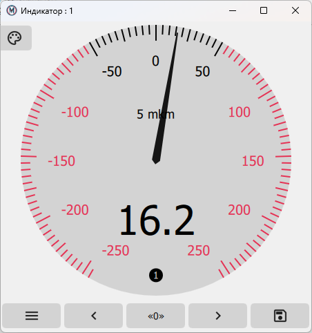
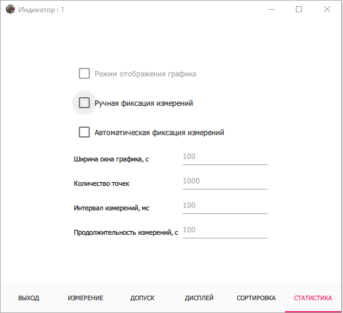
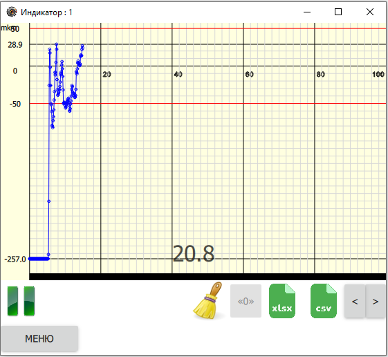

.. include:: style.rst

Вкладка СТАТИСТИКА
==================

|

Вкладка :underlined:`СТАТИСТИКА` находится внизу окна индикатора (см. `Окно индикатора`_).

Для настройки графика статистики необходимо задать показания и все настройки окна индикатора.
После закрытия окна индикатора стрелочный индикатор будет заменен на график.

В течение первых десяти замеров график будет строиться исходя из шкалы индикатора, потом будет происходить автомасштабирование оси ординат.

В процессе измерения на вкладке :underlined:`СТАТИСТИКА` будет отображаться график, построенный на основе таблицы измеренных значений.
Для детального изучения измеренных значений следует сохранить таблицу и воспользоваться специализированным программным
обеспечением, таким как :underlined:`MS Office Excel`, :underlined:`Open Office Calc` и др.

.. note:: Сохранение исходных значений для построения графика производится в формате CSV или XLSX.

.. _Окно индикатора: ./Indicators.html