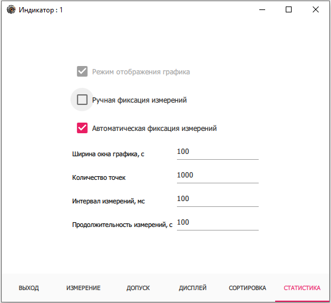
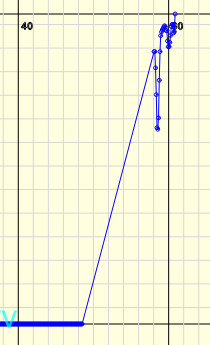
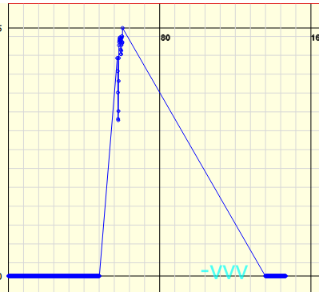
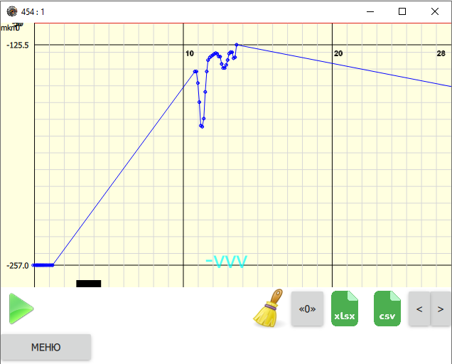

.. include:: style.rst

Вкладка "СТАТИСТИКА"
====================

|

Вкладка :underlined:`СТАТИСТИКА` открывается с помощью кнопки **МЕНЮ** внизу окна индикатора (см. `Окно индикатора`_).

.. figure:: ./_static/IndicatorStatistics.png
   :alt: IndicatorWindow
   :align: center

Для настройки графика статистики необходимо задать показания и все настройки окна индикатора.

При нажатии на кнопку **ВЫХОД** стрелочный индикатор будет заменен на график, основанный на таблице измеренных значений.
В течение первых десяти замеров график будет строиться исходя из шкалы индикатора, потом будет происходить автомасштабирование оси Y.

.. figure:: ./_static/IndicatorChart.png
   :alt: IndicatorChart
   :align: center

|

Для управления графиком под ним расположены следующие кнопки:

* |start| — начать запись измерения. Каждое измерение отмечается на графике точкой.

* |stop| — остановить запись показаний, при этом отсчет времени по оси X продолжится и на графике отобразится разрыв.

* |clear| — очистить график.
* **«0»** — установить текущие показания в качестве нулевых.
* **xlsx** и **csv** — сохранить графики в табличном виде в соответствующем формате.
* **[<]** и **[>]** — изменить масштаб по оси X.

.. figure:: ./_static/ChartZoomOut.png
   :alt: ChartZoomOut
   :align: center

.. note:: Перемещение по графику вдоль оси X осуществляется с помощью колеса прокрутки мыши.

.. _Окно индикатора: ./Indicators.html

.. |start| image:: _static/start.ico
.. |stop| image:: _static/pause.ico
.. |clear| image:: _static/clear.ico