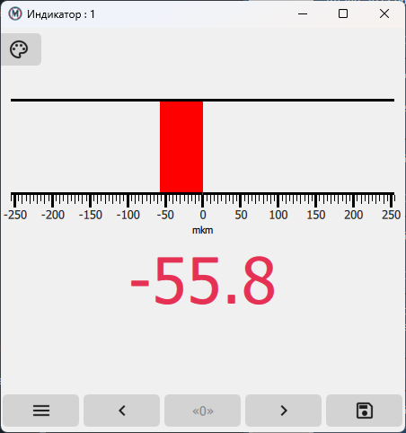
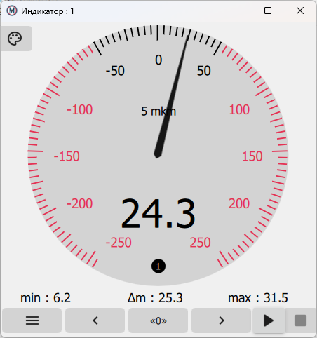
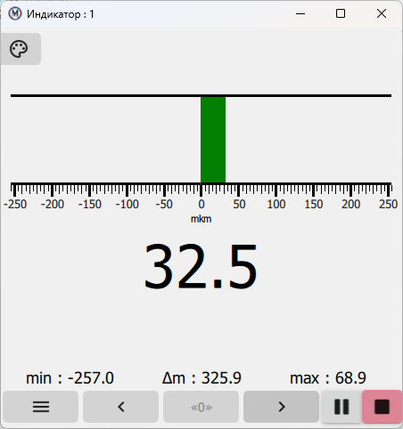
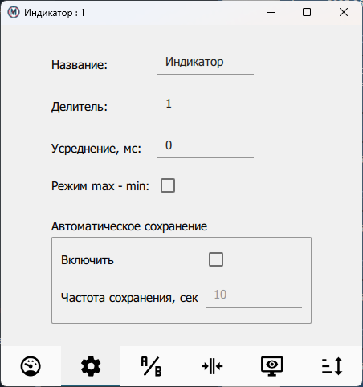

.. include:: style.rst

Окно индикатора
===============

|

.. figure:: ./_static/IndicatorWindow.png
   :alt: IndicatorWindow
   :align: center

|

Окно индикатора можно открыть несколькими способами:

* нажатием на кнопку **НОВЫЙ ИНДИКАТОР**;
* нажатием кнопки вызова индикатора |indicator| в строке любого из найденных датчиков.

.. note:: Окно индикатора откроется автоматически после запуска приложения и последующего поиска датчиков, если в предыдущем сеансе работы это окно индикатора использовалось и не было закрыто пользователем.

|

Окно индикатора открывается в режиме отображения измеряемой величины со стрелочным или цифровым индикатором.
Цвет фона стрелочного индикатора :highlightedgrey:`светло-серый`, если показания индикатора находятся в допуске заданных на вкладке :underlined:`ДОПУСК` значений
или :highlightedpink:`розовый`, если они выходят из допуска.

Под текущими показаниями стрелочного индикатора отображается круг с обозначением **1** или **2**, которые соответствуют датчикам *1* и *2*.
Периодическая смена цвета этого круга свидетельствует о правильной работе датчиков,
используемых в формуле индикатора на вкладке :underlined:`ИЗМЕРЕНИЕ` (см. `Настройки индикатора`_).

В зависимости от показаний цифровой индикатор может окрашиваться в разные цвета:

* :highlightedblack:`черный`, если показания находятся в допуске;
* :highlightedred:`красный`, если показания выходят за допустимые значения;
* :highlightedyellow:`желтый`, если показания датчика вышли за приемочную границу;
* :highlightedcyan:`голубой`, если хотя бы один из датчиков формулы на вкладке :underlined:`ИЗМЕРЕНИЕ` вышел за пределы калиброванного диапазона.

Под индикатором расположены кнопки со следующими функциями:

* |menu| позволяет войти в режим изменения настроек отображения индикатора;
* **[<]** сдвигает значение предустанова влево;
* **[0]** (**[Ø]**) устанавливает (снимает) обнуление показаний датчика;
* **[>]** сдвигает значение предустанова вправо;
* |save| позволяет сохранять измеренные значения в табличной форме на ПК в формате XLSX или CSV.

|

При фиксации измерения в обычном режиме измерения в окне индикатора формируется системное сообщение *Windows*,
которое может быть обработано макросом в файле :bolditalicred:`rec3.xlsm` (см. `Макрос протокола в Microsoft Excel`_).

В режиме *max-min* под индикатором отображаются предельные показания и размах показаний датчика.
Кнопки |play| и |stop| позволяют соответственно начать и закончить измерение детали.
Функции данных кнопок продублированы нажатием средней кнопки мыши на всей площади индикатора с целью упрощения использования
педали для управления измерениями.

|

Настройки индикатора
--------------------

|

Для изменения настроек индикатора необходимо нажать на кнопку **МЕНЮ** в нижнем левом углу окна индикатора,
после чего станут доступны следующие вкладки:

1. :underlined:`ОБЩИЕ НАСТРОЙКИ`, где устанавливаются следующие параметры индикатора:

* В поле **Название**  —  имя окна индикатора (при этом в заголовке окна также всегда будет отображаться номер индикатора, с помощью которого макрос в *Excel* определяет, от какого индикатора пришло сообщение).
* В поле **Усреднение, мс** — время в миллисекундах, если требуется усреднить показания индикатора по последним измеренным значениям датчиков.
* Чекбокс **Режим max-min** — активация режима *max-min*.
* Чекбокс **Автоматическое сохранение, мин** — активация режима автоматического сохранения измеренных значений в формате *XLS* или *CSV*, а в поле рядом — его периодичность.
* Кнопка **СОХРАНИТЬ ИЗМЕРЕНИЯ** — сохранение отмеченных показаний индикатора вручную в формате *XLSX* или *CSV*.

2. :underlined:`ФОРМУЛА`, где устанавливается правило формирования показания индикатора на основе показаний датчиков по следующей формуле:

    П = ( (М1 * И1 + С1) + (М2 * И2 + С2) ) / Д, где

    | **П** — показания индикатора,
    |
    | **М1** и **М2** — множители показаний датчиков,
    | по умолчанию имеют значение 1 (могут принимать отрицательные значения);
    |
    | **С1** и **С2** — смещение показаний датчиков,
    | по умолчанию имеют значение 0 (могут принимать отрицательные значения);
    |
    | **И1** и **И2** — показания выбранных индикаторов,
    | если индикатор не выбран, имеют значение 0;
    |
    | **Д** — делитель показаний
    | (для учета конструктивных особенностей измерительной системы).

2. :underlined:`ДОПУСК`, где можно задать приемочные границы и звуковое оповещение.

.. figure:: ./_static/IndicatorTolerance.png
   :alt: IndicatorTolerance
   :align: center

3. :underlined:`ДИСПЛЕЙ`, где устанавливаются режим отображения индикатора, цена деления и дискретность показания цифрового индикатора.

.. figure:: ./_static/IndicatorDisplay.png
   :alt: IndicatorDisplay
   :align: center

4. :underlined:`СОРТИРОВКА`, где задаются параметры сортировки, а также устанавливаются верхнее и нижнее предельные отклонения измеряемой величины.

.. figure:: ./_static/IndicatorSorting.png
   :alt: IndicatorSorting
   :align: center

.. attention:: Если закрыть окно индикатора стандартными способами *Windows*, то после перезапуска приложения окно не восстановится и все его параметры будут удалены.

 Если закрыть только главное окно приложения, то при его перезапуске окно индикатора восстановит свою работу.

.. _Настройки индикатора: ./Indicators.html#id2
.. _Макрос протокола в Microsoft Excel: ./OtherApps.html#microsoft-excel
.. _Вкладка "СТАТИСТИКА": ./Charts.html

