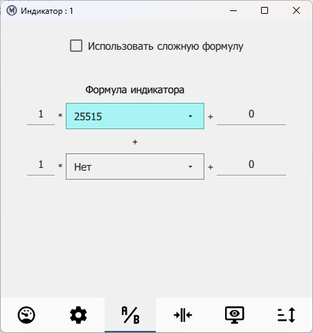

.. include:: style.rst

Окно индикатора
===============

|

.. figure:: ./_static/IndicatorOuterView.png
   :alt: IndicatorOuterView
   :align: center

Окно индикатора открывается в следующих случаях:

* После запуска приложения и последующего поиска датчиков, если в предыдущем сеансе работы это окно индикатора использовалось.
* При нажатии кнопки **НОВЫЙ ИНДИКАТОР**.
* При двойном щелчке левой кнопки мыши над соответствующей записью из списка найденных датчиков в главном окне.

При открытии, окно индикатора автоматически открывается в режиме отображения измеряемой величины со стрелочным или цифровым индикатором.

2. Описание индикатора
В окне представлен стрелочный индикатор с дублированием показаний в цифровом виде или только цифровой индикатор.
В некоторых случаях, описанных ниже, возможно отображение информации о результатах сортировки или контроля в режиме MAX-MIN.
Фон индикатора имеет светло-желтый цвет, если показания индикатора находятся в допуске заданных на вкладке :underlined:`ДОПУСК` значений,
и розовый, если выходят из допуска.

В зависимости от показаний цифровой индикатор может окрашиваться в разные цвета:

* :highlightedblack:`черный`, если показания находятся в допуске;
* :highlightedred:`красный`, если показания выходят за допустимые значения;
* :highlightedyellow:`желтый`, если показания датчика вышли за приемочную границу;
* :highlightedcyan:`голубой`, если хотя бы один из датчиков формулы на вкладке :underlined:`ИЗМЕРЕНИЕ` вышел за пределы калиброванного диапазона.

Под текущими показаниями стрелочного индикатора отображается круг с обозначением **1** или **2** соответствующих датчикам *1* и *2*.
Периодическая смена цвета этого круга свидетельствует о правильной работе датчиков,
используемых в формуле индикатора на вкладке :underlined:`ИЗМЕРЕНИЕ`.

В нижней части окна индикатора расположены кнопки со следующими функциями:

* **МЕНЮ** позволяет войти в режим изменения настроек отображения индикатора;
* «<» сдвигает значение предустанова влево;
* **[0]** (**[Ø]**) устанавливает (снимает) обнуление показаний датчика;
* **[>]** сдвигает значение предустанова вправо;
* **DATA** позволяет сохранять измеренные значения в табличной форме на ПК в формате XLSX или CSV.

В режиме *MAX-MIN* над кнопками отображаются предельные показания и размах показаний датчика.
Кнопка **START/STOP** позволяет начать и закончить измерение детали.
Функции данной кнопки продублированы нажатием средней кнопки мыши на всей площади индикатора с целью использования
педали для управления измерениями.

Для обычного режима измерения (не MAX-MIN или сортировки) при фиксации измерения в окне индикатора, окно индикатора формирует
системное сообщение операционной системы Windows, которое может быть обработано макросом, представленным в файле rec.xlsm.
При открытии это файла программой Microsoft Excel, разрешите запуск макросов. Макрос приема сообщений запустится при открытии файла
автоматически. Повторно его можно запустить, нажав горячую комбинацию клавиш Excel : Alt + F8. В окне макросов выбрать StartMeas.

Меню в окне индикатора
----------------------

|

Для перехода в меню индикатора необходимо нажать на кнопку **МЕНЮ** в нижнем левом углу окна :bolditalic:`Индикатор`,
после чего станут доступны вкладки:

* :underlined:`ИЗМЕРЕНИЕ`, где устанавливается правило формирования показания индикатора на основе показаний датчиков по следующей формуле:

П = ( (М1 * И1 + С1) + (М2 * И2 + С2) ) / Д, где

| **П** - показания индикатора,
| **М1** и **М2** - множители показаний датчиков, по умолчанию имеют значение 1, могут принимать отрицательные значения,
| **С1** и **С2** - смещение показаний датчиков, по умолчанию имеют значение 0, могут принимать отрицательные значения,
| **И1** и **И2** - показания выбранных индикаторов, если индикатор не выбран, имеют значение 0,
| **Д** – делитель показаний (для учета конструктивных особенностей измерительной системы).

В поле **Название** можно задать имя окна индикатора, но в заголовке окна также всегда будет отображаться номер индикатора, с помощью которого макрос в *Excel* определяет, от какого индикатора пришло сообщение.
В поле **Усреднение, мс** указывается время в миллисекундах, если требуется усреднить показания индикатора по последним измеренным значениям датчиков.
Чекбокс **Режим max-min** позволяет активировать режим *max-min*.
Чекбокс **Автоматическое сохранение, мин** позволяет сохранять отмеченные показания индикатора по указанию пользователя, или приложение будет автоматически сохранять измеренные значения в выбранном формате XLS или CSV.

* :underlined:`ДОПУСК`, где можно задать приемочные границы и звуковое оповещение.

* :underlined:`ДИСПЛЕЙ`, где устанавливаются режим отображения индикатора, цена деления и дискретность показания цифрового индикатора.

.. figure:: ./_static/IndicatorDisplay.png
   :alt: IndicatorDisplay
   :align: center

* :underlined:`СОРТИРОВКА`, где задаются параметры сортировки, а также устанавливаются верхнее и нижнее предельные отклонения измеряемой величины.

.. figure:: ./_static/IndicatorSorting.png
   :alt: IndicatorSorting
   :align: center

* :underlined:`СТАТИСТИКА`, где можно заменить индикатор на график измерений (см. `вкладка СТАТИСТИКА`_).

.. attention:: Если окно :bolditalic:`Индикатор` закрыть стандартными способами ОС Windows, то после перезапуска приложения окно не восстановится и все его параметры будут удалены.

 Если закрыть только главное окно приложения, то при его перезапуске окно :bolditalic:`Индикатор` восстановит свою работу.

.. _вкладка СТАТИСТИКА: ./Charts.html