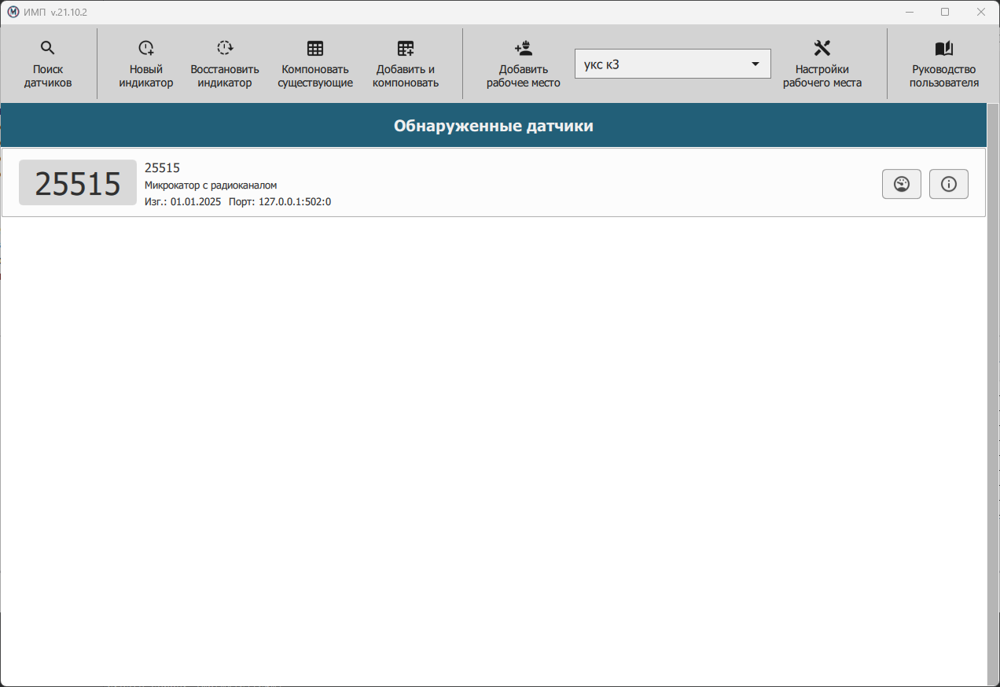

.. include:: style.rst

Главное окно приложения
=======================

|

|

Поиск датчиков
--------------

|

Поиск датчиков осуществляется в следующих случаях:

* сразу после запуска приложения;
* при нажатии кнопки **ПОИСК ДАТЧИКОВ**.

|

Запуск окна индикатора
----------------------

|

.. tip:: Для более подробной информации см. `Окно индикатора`_.

Окно индикатора открывается в следующих случаях:

* После запуска приложения и последующего поиска датчиков, если в предыдущем сеансе работы это окно индикатора использовалось и не было закрыто пользователем. При этом оно запустится с ранее установленными настройками и формулой для показаний индикатора.
* При нажатии кнопки **НОВЫЙ ИНДИКАТОР**. Окно индикатора появится в центре экрана с настройками, принятыми в приложении по умолчанию, при этом в формуле индикатора будет выбран только один датчик, который является первым в списке датчиков.
* При двойном щелчке левой кнопки мыши над соответствующей записью из списка найденных датчиков. Окно индикатора появится в центре экрана с настройками, принятыми в приложении по умолчанию, но показания индикатора будут соответствовать показаниям выбранного датчика.

.. note:: Для одного датчика можно открыть несколько индикаторов.

 Показания одного датчика могут использоваться в нескольких индикаторах.

 Всего окон индикаторов можно открыть не более 255.

|

Окно настройки датчика
----------------------

|

.. tip:: Для более подробной информации см. `Окно настройки датчика`_.

Окно :bolditalic:`Настройки датчика` позволяет увидеть изменяемые и неизменяемые пользователем настройки датчика.
Для его открытия необходимо нажать на кнопку **Настройки** в строке желаемого датчика из списка найденных.
Внешний вид окна зависит от типа, изготовителя и принципа действия датчика.

.. tip:: Получить дополнительную информацию о приложении можно с помощью кнопок **ПОМОЩЬ** и **A**.

.. attention:: При выходе из приложения окна помощи, индикаторов и настроек датчика закрываются автоматически. Все окна индикаторов восстановятся при следующем запуске приложения, если они не были закрыты пользователем вручную.

.. _Окно индикатора: ./Indicators.html
.. _Окно настройки датчика: ./Settings.html