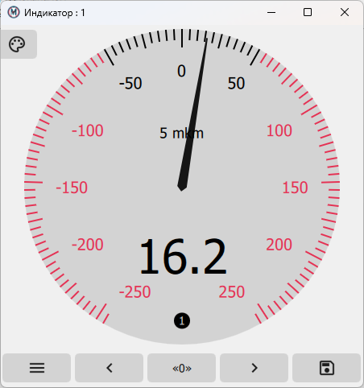

.. include:: style.rst

Главное окно приложения
=======================

|

Элементы управления
-------------------

|

Кнопки на ленте:

* **Поиск датчиков** — запуск поиск датчиков.
* **Новый индикатор** — создание ннового окна индикатора с пустой формулой.
* **Восстановить индикатор** — восстановление индикатора, закрытого пользователем ранее.
* **Компоновать существующие** — автоматическая расстановка открытых индикаторов на экране монитора.
* **Добавить и компоновать** — замощение индикаторами всего экрана монитора.
* **Добавить рабочее место** — создание нового рабочего места. В выпадающем меню справа можно выбрать любое из созданных рабочих мест.
* **Настройки рабочего места** — настройка поиска и рабочего места.
* **Руководство пользователя** — открытие справочной информации о приложении.

Кнопки в строке любого из найденных датчиков:

* |indicator| — вызов окно индикатора с показаниями выбранного датчика и формулой индикатора для него.
* |info| — просмотр параметров выбранного датчика.

|

Поиск датчиков
--------------

|

Поиск датчиков осуществляется в следующих случаях:

* сразу после запуска приложения;
* при нажатии кнопки **ПОИСК ДАТЧИКОВ**.

.. note:: У любого из найденных датчиков можно просмотреть параметры с помощью кнопки вывода информации |info| в соответветствующей строке.

 .. figure:: ./_static/IndicatorInfo.png
   :alt: IndicatorInfo
   :align: center

|

Запуск окна индикатора
----------------------

|

.. tip:: Для более подробной информации см. `Окно индикатора`_.

Окно индикатора открывается в следующих случаях:

* После запуска приложения и последующего поиска датчиков, если в предыдущем сеансе работы это окно индикатора использовалось и не было закрыто пользователем. При этом оно запустится с ранее установленными настройками и формулой для показаний индикатора.
* При нажатии кнопки **НОВЫЙ ИНДИКАТОР**. Окно индикатора запустится с настройками, принятыми в приложении по умолчанию, при этом формула индикатора будет пустой и в ней будет выбран только один датчик, который является первым в списке датчиков.
* При нажатии кнопки вызова индикатора |indicator| в строке любого из найденных датчиков. Окно индикатора запустится с настройками, принятыми в приложении по умолчанию, но показания индикатора будут соответствовать показаниям выбранного датчика. При этом в формуле индикатора будет выбранный индикатор.

.. note:: Для одного датчика можно открыть несколько индикаторов.

 Показания одного датчика могут использоваться в нескольких индикаторах.

 Всего окон индикаторов можно открыть не более 255.

|

Создание и удаление рабочего места
----------------------------------

|

Для создания нового рабочего места необходимо:

1. Нажать на кнопку **Добавить рабочее место**, после чего появится диалоговое окно со списком созданных рабочих мест. По умолчанию в нем создано одно рабочее место.
2. Нажать на кнопку **[+]**. При двойном щелчке левой клавиши мыши по ячейке в столбце *Имя* можно изменить название рабочего места.

Для удаления рабочего места необходимо:

1. Выбрать нужную строку рабочего места одинарным щелчком левой кнопки мыши (при этом строка подсветится :highlightedblue:`синим` цветом).
2. Нажать на кнопку **[-]**, после чего выбранное рабочее место пропадет из списка созданных.

.. note:: В окне со списком созданных рабочих мест можно редактировать только их названия. Изменение прочих настроек выбранного в выпадающем меню рабочего места происходит на отдельных вкладках с помощью кнопки **Настройки рабочего места**.

 .. figure:: ./_static/WorkshopSearchSettings.png
   :alt: WorkshopSearchSettings
   :align: center

 .. figure:: ./_static/WorkshopSettings.png
   :alt: WorkshopSettings
   :align: center

.. _Окно индикатора: ./Indicators.html

.. |info| image:: _static/info.png
