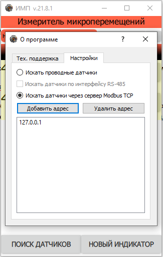

.. include:: style.rst

Взаимодействие с другим ПО
==========================

|

Программа ИМП может работать в связке с другими ПО, описанными ниже

Программа MeasServer.

Эта программа должна быть запущена до выполнения поиска новых датчиков в программе ИМП. При этом в программе ИМП требуется указать, что датчики необходимо искать на сервере Modbus TCP

По умолчанию программа ИМП ищет проводные датчики. Но если указать поиск на сервере, программа запомнит это указание.

ВНИМАНИЕ!!! Если запущена программа MeasServer, то программа ИМП обнаружить проводные датчики, подключенные к компьютеру не сумеет, так как их уже ранее захватит MeasServer.

И наоборот, если программа ИМП уже обнаружила проводные датчики, то к этим датчикам программа MeasServer подключиться не сможет.

Макрос протокола в Microsoft Excel.

В рабочем каталоге программы ИМП расположен файл rec.xlsm.

Файл из рабочего каталога можно перенести в любое удобное для пользователя место дискового пространства компьютера.

Это файл - заготовка протокола, который может быть заполнен автоматически программой ИМП.

Макрос в файле принимает сообщения из программы ИМП о показаниях открытых индикаторов программы ИМП и результатах измерений датчиков, найденных программой.

При открытии файла, Excel выдаст предупреждение системы безопасности. Требуется включить содержимое файла.

.. figure:: ./_static/ExcelProtocol.png
   :alt: ExcelProtocol
   :align: center

По умолчанию в этом файле создано две страницы протокола и одна страница настроек.

Страницы протоколов можно копировать, но имена страниц не должны повторяться.

Страница настроек должна быть одна, и её имя не должно изменяться: «Настройки».

Пользователь должен указать макросу куда и как записывать полученные от программы ИМП данные. Это делается на странице настроек.

Дополнительное описание, как настроить запись для макроса представлено на самой странице настроек. Там же приведены рабочие примеры.

Запуск макроса осуществляется нажатием на кнопку «Открыть окно записи измерений» на одной из страниц протоколов.

.. figure:: ./_static/ExcelMacro.png
   :alt: ExcelMacro
   :align: center

Откроется окно макроса.

.. figure:: ./_static/MacroWindow.png
   :alt: MacroWindow
   :align: center

Выбрать действие макроса: либо запись будет вестись на все протоколы, либо только в тот протокол, откуда был запущен макрос.

Далее действовать по подсказкам окна макроса.