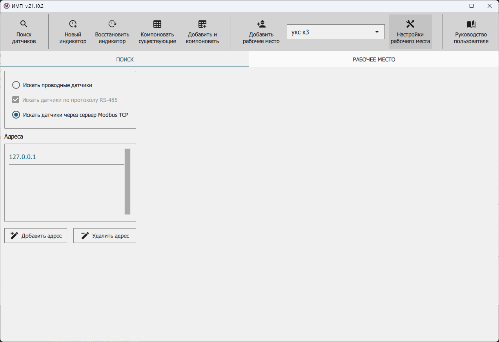
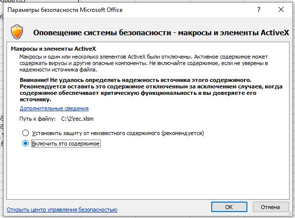
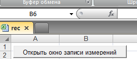
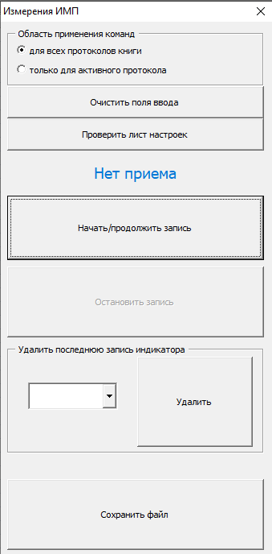

.. include:: style.rst

Взаимодействие с другим ПО
==========================

Приложение **MeasServer**
-------------------------

|

Для использования приложения **MeasServer** совместно с приложением **ИМП**, необходимо:

1. Запустить приложение **MeasServer**.
2. В приложении **ИМП** указать вариант **Искать датчики через сервер Modbus TCP** с помощью радиокнопки на вкладке :underlined:`Настройки`, при этом выбор будет сохранен.
3. Выполнить поиск новых датчиков нажатием кнопки **ПОИСК ДАТЧИКОВ**.

.. attention:: По умолчанию в приложении **ИМП** выбран поиск проводных датчиков, однако оно их обнаружить не сможет, если ранее было запущено приложение **MeasServer**, так как датчики уже используются в нем.

 Таким же образом, если проводные датчики используются приложением **ИМП**, то приложение **MeasServer** не сможет к ним подключиться.

|

Макрос протокола в **Microsoft Excel**
--------------------------------------

|

В рабочем каталоге приложения **ИМП** расположен файл :bolditalicred:`rec.xlsm`, являющийся заготовкой протокола,
который может быть заполнен автоматически. Его можно перенести в любое удобное для пользователя место дискового пространства ПК.

При открытии файла в *Microsoft Excel* появится предупреждение системы безопасности, где потребуется разрешить запуск макросов,
выбрав вариант **Включить это содержимое** с помощью радиокнопки. Макрос приема сообщений запустится при открытии файла автоматически.
Повторно его можно запустить, нажав горячую комбинацию клавиш *Excel* — **Alt + F8**. В окне макросов нужно выбрать **StartMeas**.

Данный макрос принимает сообщения о показаниях индикаторов, открытых в приложении **ИМП**,
и результатах измерений найденных им датчиков. Кроме того, он позволяет автоматическое построение графиков
(полная инструкция представлена на странице *Настройки* файла :bolditalicred:`rec3.xlsm`).

По умолчанию в файле создано две страницы протокола и одна страница *Настройки*.
Страницы протоколов можно копировать, но их имена не должны повторяться.
Страница *Настройки* должна оставаться в единственном экземпляре и с неизменным именем.
На ней необходимо указать путь и способ записи данных, полученных от приложения **ИМП**.
Здесь же содержится дополнительная информация по автоматическому построению графиков, настройке записи для макроса и приведены рабочие примеры.

Чтобы запустить макрос, необходимо нажать на кнопку **Открыть окно записи измерений** на одной из страниц протоколов.

После этого откроется окно макроса, где с помощью радиокнопки нужно выбрать одно из его действий —
**вести запись для всех протоколов** или **только для активного протокола**, откуда был запущен макрос.
Далее действовать по подсказкам в окне макроса.

