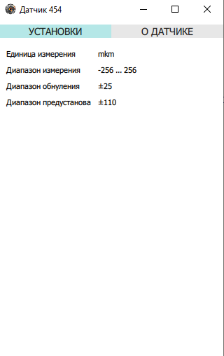
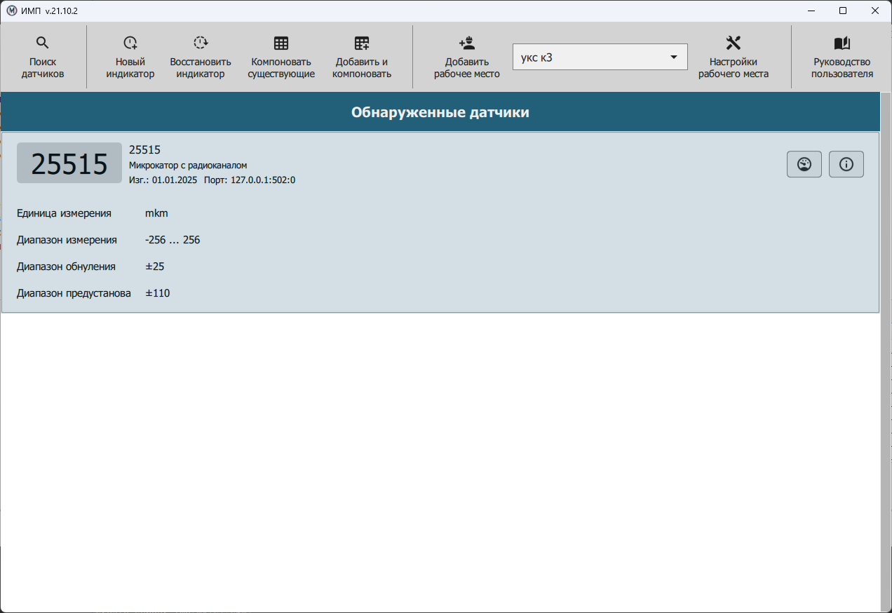

.. include:: style.rst

Окно настройки датчика
======================

|

Окно :bolditalic:`Настройки датчика` служит для просмотра настроек датчика,
а в некоторых случаях также и изменения его параметров (например, пользовательского имени).
Внешний вид диалогового окна :bolditalic:`Настройки датчика` зависит от типа датчика, его принципа действия и изготовителя.

Чтобы открыть окно :bolditalic:`Настройки датчика`, необходимо нажать на кнопку **[...]** в строке желаемого датчика
из списка найденных в главном окне приложения (см. `Главное окно приложения`_).

На вкладке :underlined:`Дополнительная информация` предоставляются сведения об изготовителе датчика.

.. _Главное окно приложения: ./MainWindow.html